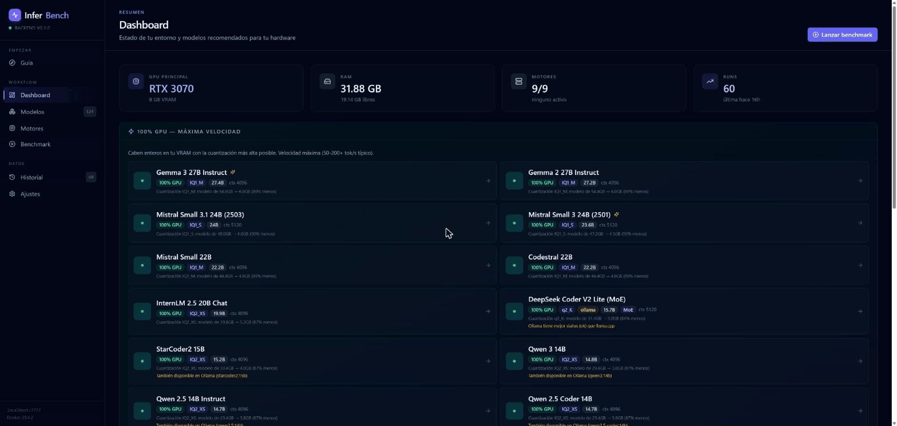
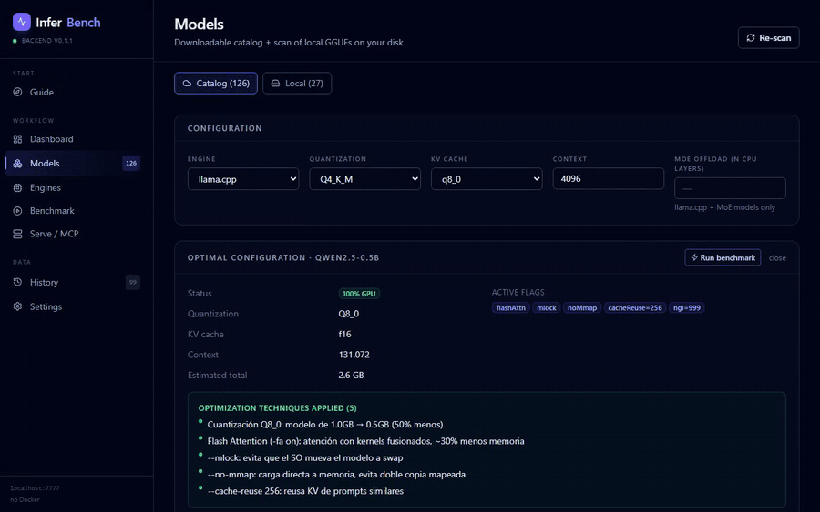

<h1 align="center">InferBench</h1>

<p align="center">
  <b>Descarga, arranca y benchmarkea motores de inferencia LLM locales con un solo click.</b><br>
  Sin Docker obligatorio. Sin tocar la línea de comandos. Tus datos nunca salen de tu máquina.
</p>

<p align="center">
  
  
  
  <a href="https://github.com/JoniMartin27/inferbench/actions/workflows/ci.yml"></a>
  
  
  <a href="https://github.com/JoniMartin27/inferbench/releases"></a>
</p>

<p align="center">
  ⭐ <b>¿Te ahorra tiempo decidiendo qué modelo entra en tu GPU? <a href="https://github.com/JoniMartin27/inferbench">Dale una estrella</a></b> — es la forma más rápida de ayudar.<br>
  ¿Te falta un motor o algo no arranca en tu hardware? <a href="https://github.com/JoniMartin27/inferbench/issues">Abre un issue</a> y lo miramos.
</p>

<p align="center">
  
</p>

<details align="center">
  <summary>🎬 Ver la app real en acción (demo completa)</summary>
  <p align="center">
    
  </p>
</details>

<p align="center">
  
  
</p>

---

¿Quieres correr LLMs en local pero no sabes **qué cuantización te entra en tu GPU**, ni **a cuántos tok/s va a ir**, ni **qué motor es más rápido para tu hardware**? InferBench lo responde por ti, midiendo de verdad — sin números inventados.

```
Eliges modelo + cuantizaciones → InferBench:
  ① descarga el binario del motor (release oficial GitHub)
  ② descarga los GGUF que falten desde Hugging Face
  ③ arranca el motor con la config óptima para tu hardware
  ④ ejecuta la suite de prompts midiendo TTFT, tok/s, VRAM, calidad
  ⑤ guarda los resultados y te deja compararlos lado a lado
```

## Ejemplo real

RTX 3070 · 8 GB VRAM · 32 GB RAM — corriendo **SmolLM2-360M Q8_0** con llama.cpp nativo:

| Métrica | Resultado |
|---|---|
| TTFT | 588 ms |
| Throughput | 272 tok/s |
| VRAM pico | 2.47 GB |
| Calidad (offline scorer) | 75 / 100 |
| Contexto automático | 8 192 tokens |

*Números sacados del runner de producción — sin datos inventados.*

---

## Descargar

Coge el instalador para tu sistema desde la [**página de Releases**](https://github.com/JoniMartin27/inferbench/releases) — no necesitas Python ni Node instalados, el backend va embebido como sidecar:

| Sistema | Archivo |
|---|---|
| Windows | `InferBench Setup *.exe` (NSIS) |
| macOS | `InferBench-*.dmg` |
| Linux | `InferBench-*.AppImage` |

> ¿Prefieres compilarlo tú? Salta a [Instalación (desarrollo)](#instalación-desarrollo).

---

## Features

- **Auto-bootstrap end-to-end**: 1 click → binario + modelo + arranque + benchmark + cleanup
- **Modo nativo (sin Docker)** para llama.cpp: descarga release pre-compilada de GitHub (auto-detecta CUDA, descarga también las DLLs del runtime)
- **Modo Docker** disponible para cualquier motor que lo requiera
- **Detección automática de hardware**: CPU, RAM, GPU (NVIDIA via NVML, AMD via rocm-smi, Apple Silicon via system_profiler). Cacheada para que el listado de compatibilidad sea instantáneo (~4 ms para todo el catálogo)
- **Catálogo de 126 modelos** con auto-descarga GGUF desde HF, todos verificados contra HuggingFace (incluye visión, código, reasoning, MoE y difusión de imagen). Ver [Catálogo](#catálogo-de-modelos-con-auto-descarga)
- **Escaneo de GGUFs locales**: detecta modelos de LM Studio, Ollama, HF cache, etc., con cuenta de parámetros real leída de la metadata GGUF (independiente del quant)
- **Visión real (multimodal)**: para modelos de visión (Qwen2-VL, Qwen2.5-VL, MiniCPM-V) descarga el `mmproj`, arranca llama-server con `--mmproj` y benchmarkea un prompt con **imagen real** vía la API de visión OpenAI-compatible. También en **APIs** (gpt-4o, claude) y motores **Docker** (vLLM sirve el modelo de visión) — aunque vLLM con un modelo de visión necesita bastante VRAM (un 2B no entra holgado en 8 GB; en local, llama.cpp es la ruta fiable a poca VRAM)
- **Optimizador**: dado tu hardware + modelo + motor, calcula la mejor cuantización, KV-cache, contexto máximo, MoE offload, flags
- **Compresión de KV-cache explicada**: 5 presets (Calidad→Extremo) con qué hace / en qué afecta / qué permite, + tabla de los **modelos más potentes que caben con cada compresión** para tu hardware
- **Evaluación de calidad en 3 modos**: scorer offline basado en referencia (sin GPU/API, corre en cualquier PC), LLM-judge con el motor local, o LLM-judge por API externa. Ver [Calidad](#evaluación-de-calidad)
- **Modo sweep**: lanza el mismo modelo con N cuantizaciones distintas en cola
- **Comparación**: selecciona varias runs del historial, ve métricas y gráficos lado a lado
- **SSE en vivo**: progreso de descargas (con %), TTFT, tok/s actual, log estilo terminal
- **Descargas resilientes**: GGUFs de decenas de GB con reintentos automáticos (backoff exponencial) y **reanudación** desde el parcial vía cabecera Range si la red se corta
- **API keys en el keyring del SO**: guarda las claves de OpenAI/Anthropic/OpenRouter/NVIDIA en el gestor de credenciales del sistema (Ajustes → API keys); el benchmark las usa solo, nunca se escriben a disco
- **Observabilidad con lookspan** (opt-in): si defines `LOOKSPAN_ENDPOINT`, cada run de benchmark se exporta como un **trace** a [lookspan](https://github.com/JoniMartin27/lookspan) (span raíz + un `llm_call` por prompt con TTFT, tok/s, VRAM y calidad reales). Best-effort: un fallo de red nunca rompe el benchmark
- **Stop en cualquier momento**: cancela bootstrap, descarga o ejecución
- **Persistencia**: SQLite con todos los runs (engine, modelo, quant, flags, métricas por prompt, output bruto)
- **Modo Serve / MCP**: sirve un modelo cuantizado **óptimo** de forma residente y exponlo a cualquier app por **MCP**. Ver [Serve / MCP](#serve--mcp)
- **Generación de imagen** (local): además de LLM de texto, InferBench orquesta **modelos de imagen** vía [stable-diffusion.cpp](https://github.com/leejet/stable-diffusion.cpp) — mismo patrón que con llama.cpp. Sirve un modelo de imagen y **genera** desde la app o por MCP (`generate_image`). Ver [Generación de imagen](#generación-de-imagen)

---

## Serve / MCP

Además de benchmarkear, InferBench puede **servir** un modelo cuantizado de forma
**residente** y exponerlo a cualquier app por **MCP** (Model Context Protocol). Reusa la
misma tubería del benchmark (detección de hardware → optimizador → descarga de GGUF →
arranque del motor): InferBench actúa de **intermediario que orquesta los modelos**, elige la
**cuantización óptima** para tu hardware, descarga el GGUF, arranca el motor y enruta la
inferencia.

```
Eliges modelo (o "recomendar para mi hardware") → InferBench:
  ① elige la cuantización óptima para tu GPU (o respeta la que indiques)
  ② descarga el GGUF que falte desde Hugging Face
  ③ arranca el motor de forma residente y expone su endpoint OpenAI
  ④ lo publica como servidor MCP "inferbench" para Claude Desktop / Cursor / etc.
```

> **v1**: motor `llamacpp` (nativo, siempre disponible) y **un solo modelo servido a la vez**
> (slot único). La API es agnóstica de motor; otros motores llegarán después.

### Una sola app, dos modos

InferBench es **una app unificada**, no dos. Desde **Ajustes → Modos / Features** activas o
desactivas cada modo con un toggle:

- **Benchmark** — Dashboard, Motores, Modelos, Benchmark, Historial.
- **Serve / MCP** — la vista **Serve**.

Ambos vienen **ON** por defecto. Al desactivar un modo, sus ítems desaparecen de la barra
lateral (la preferencia se guarda en `localStorage`). **Nunca puedes desactivar los dos a la
vez**: siempre queda al menos uno.

### La vista Serve

1. Elige un modelo del catálogo o pulsa **recomendar para mi hardware**; deja la cuantización
   en **Auto (óptimo)** o fíjala a mano.
2. Pulsa **Servir**: InferBench descarga (si hace falta) y arranca el motor, mostrando la
   **fase** y el **progreso** hasta `ready`, y te da el **endpoint** OpenAI del modelo.
3. Pruébalo en el **mini-chat** integrado.
4. Abre **Conectar por MCP** para copiar el snippet de configuración listo para Claude
   Desktop / Cursor, o la URL HTTP.
5. **Parar** libera la VRAM.

### Conectar Claude Desktop / Cursor

InferBench expone un servidor MCP llamado **`inferbench`** con dos transportes:

- **stdio** — el cliente lanza el sidecar del backend con el flag `--mcp`. Pega esto en la
  config de Claude Desktop (`claude_desktop_config.json`) o de Cursor:

  ```json
  {
    "mcpServers": {
      "inferbench": {
        "command": "C:\\ruta\\a\\inferbench-backend.exe",
        "args": ["--mcp"]
      }
    }
  }
  ```

  El panel **Conectar por MCP** de la vista Serve te da el snippet con la ruta real ya
  rellenada.

- **HTTP** — para clientes que hablan MCP sobre HTTP, apunta a:

  ```
  http://localhost:7777/mcp
  ```

> El transporte stdio **no** arranca su propio motor: hace de proxy al backend. Por eso **la
> app InferBench debe estar abierta** para servir un modelo por MCP. Si no lo está, las tools
> devuelven un error claro ("InferBench no está abierto…") en vez de fallar.

**Tools MCP**: `list_models`, `recommend_models`, `get_hardware`, `serve_model`,
`serve_status`, `chat`, `stop_model` y `generate_image` (si el modelo servido es de imagen).
La guía completa (qué hace cada tool, snippets y troubleshooting) está en
**[docs/MCP.md](docs/MCP.md)**.

---

## Generación de imagen

InferBench no se queda en LLM de texto: orquesta también **modelos de imagen** locales,
**reutilizando exactamente el mismo patrón**. Donde para texto usa el binario nativo de
**llama.cpp** + GGUF, para imagen usa su hermano de difusión,
**[stable-diffusion.cpp](https://github.com/leejet/stable-diffusion.cpp)** (binario CUDA
precompilado de los releases de GitHub + pesos GGUF/safetensors de Hugging Face + su **server
HTTP**). InferBench sigue siendo el **intermediario que orquesta**: elige los pesos, descarga
lo que falte (incluidos los **archivos auxiliares** de FLUX), arranca `sd-server` de forma
residente y enruta la generación.

```
Eliges un modelo de imagen → InferBench:
  ① descarga el binario de stable-diffusion.cpp (release oficial GitHub + DLLs CUDA)
  ② descarga los pesos GGUF/safetensors (y los auxiliares t5xxl/clip_l/vae de FLUX)
  ③ arranca sd-server de forma residente (puerto 7861) y expone su API de imagen
  ④ genera con tu prompt y te devuelve el PNG — desde la app o por MCP (generate_image)
```

> Vive **dentro del modo Serve** existente (no es un modo nuevo) y comparte el **slot único**:
> una GPU = un modelo servido a la vez, sea de **texto o de imagen**.

### Servir y generar

En la **vista Serve**, el selector incluye los modelos de imagen (agrupados por modalidad).
Al servir uno de imagen, en vez del mini-chat aparece un **GenerateCard**: prompt, negative
prompt opcional, **steps** (slider, 20 por defecto), **tamaño** con presets
(512×512 / 768×768 / 1024×1024), **seed** (con botón aleatorio) y botón **Generar**, con
**preview** de la imagen y el **tiempo** de generación. Por API:
`POST /api/serve/generate` (proxy a la API AUTOMATIC1111-compatible `/sdapi/v1/txt2img` del
server, respuesta `images: [PNG base64]`); si no hay modelo de imagen `ready` → **HTTP 409**.
Por **MCP**, la tool `generate_image` devuelve la imagen para que Claude Desktop la **muestre**.

### Modelos (requisitos honestos en 8 GB)

| Modelo | Archivos | VRAM aprox. (8 GB) |
|--------|----------|--------------------|
| **SD 1.5 / SD-Turbo** | single-file | ~2–4 GB · entra holgado (default garantizado) |
| **SDXL** | single-file | ~6–8 GB · ajustado a 1024×1024 |
| **FLUX.1-schnell (Q4)** | multi-archivo (diffusion + t5xxl + clip_l + vae) | ~7–8 GB · al límite (showcase) |

> El **vídeo** (Wan2.1/Wan2.2, LTX — ya soportados por stable-diffusion.cpp) llega en una
> **fase 2**; esta entrega es **solo imagen**. El pipeline de benchmark no cambia: no hay
> métricas de generación todavía.

La guía completa (modelos, cuantización, archivos auxiliares de FLUX y troubleshooting) está
en **[docs/IMAGE.md](docs/IMAGE.md)**.

---

## Stack

| Capa | Tecnología |
|------|------------|
| App de escritorio | Electron 42 |
| Frontend | React 18 + Vite 8 + TailwindCSS + Recharts + lucide-react |
| Backend | FastAPI (Python 3.11) + uvicorn + sse-starlette |
| Persistencia | SQLite vía SQLModel |
| GPU detection | psutil + pynvml + system_profiler / rocm-smi |
| Containers | Docker SDK for Python |
| Native runtime | subprocess.Popen + binarios oficiales de GitHub |
| Empaquetado | electron-builder + PyInstaller |

---

## Motores soportados

| Motor | Tipo | Modo nativo | Modo Docker | Auto-descarga modelo |
|-------|------|-------------|-------------|----------------------|
| `llamacpp` | local | ✅ binarios oficiales | ✅ | ✅ HuggingFace GGUF |
| `stablediffusion` | local | ✅ binarios oficiales (sd.cpp) | — | ✅ HuggingFace GGUF/safetensors |
| `ollama` | local | ✅ daemon Ollama | ✅ | ✅ registro Ollama |
| `vllm` | local | — | ✅ (GPU NVIDIA) | ✅ HF (en contenedor) |
| `sglang` | local | — | ✅ (GPU NVIDIA) | ✅ HF (en contenedor) |
| `tgi` | local | — | ✅ (GPU NVIDIA) | ✅ HF (en contenedor) |
| `openai` | API | n/a | n/a | n/a |
| `anthropic` | API | n/a | n/a | n/a |
| `openrouter` | API | n/a | n/a | n/a |
| `nvidia` | API | n/a | n/a | n/a |

> Todos los motores locales tienen adaptador completo (build de comando por motor, bootstrap automático y schema de optimización propio). `stablediffusion` (stable-diffusion.cpp, nativo) es el motor de **imagen**: sirve un modelo de difusión por su server HTTP en `:7861` — no benchmarkea, genera (ver [Generación de imagen](#generación-de-imagen)). vLLM/SGLang/TGI son Docker-only y requieren GPU NVIDIA; el modelo lo descarga el propio contenedor desde HuggingFace (le pasamos el repo id). Las APIs cloud funcionan con tu API key (sólo parámetros de sampling, sin optimización local): **OpenAI / OpenRouter / NVIDIA** usan el endpoint OpenAI-compatible `/v1/chat/completions`; **Anthropic** usa su **API nativa** (`/v1/messages`, header `x-api-key` + `anthropic-version`, `system` aparte), no es OpenAI-compatible.
>
> **Speculative decoding (DFLASH)**: vLLM y SGLang aceptan acelerar con un modelo *draft* block-diffusion ([DFLASH](https://github.com/z-lab/dflash), 6-8× sin pérdida de calidad). En Benchmark, con vLLM/SGLang seleccionado, activa DFLASH e indica el modelo draft (p.ej. `z-lab/Qwen3.5-35B-A3B-DFlash`). SGLang es la ruta oficial; vLLM necesita una build con soporte. Requiere VRAM para el modelo **y** el draft, así que no entra en GPUs pequeñas.
>
> **Estado de verificación:** los **5 motores locales** (`llamacpp`, `ollama`, `vllm`, `sglang`, `tgi`) verificados end-to-end por el runner de producción (bootstrap → arranque → inferencia real con tps>0 → parada sin contenedores colgados) en GPU NVIDIA (RTX 3070, 8 GB). vLLM/SGLang ajustan la fracción de VRAM a la memoria libre real para no fallar en GPUs no vacías.

---

## Optimizaciones aplicadas (llama.cpp)

Por defecto, basadas en `core/optimizer.py`:

- **Cuantización óptima**: itera de mayor a menor calidad (Q8 → Q2) hasta que cabe
- **Plan por run** (`optimizer.plan_llamacpp_run`): el **contexto máximo** y `ngl` se calculan para el **quant que de verdad se ejecuta** y la **KV efectiva elegida** (no para el quant que el optimizer habría elegido) — antes podía dar OOM al correr un quant distinto, o desaprovechar la compresión
- **Contexto máximo automático** con **KV-cache exacta** de la arquitectura real (`n_layer`·`n_head_kv`·`head_dim`) — captura GQA/MQA
- **KV-cache compresión** (`-ctk -ctv`): f16 / q8_0 / q4_0 (+ K/V independientes y presets). La **KV cuantizada fuerza `-fa on`** (llama.cpp lo exige). ⚠️ q4_0 en K es agresivo y puede degradar/romper la generación en modelos pequeños; **q8_0 es el punto dulce**
- **KV en RAM** (`--no-kv-offload`, preset *Extremo*): libera VRAM y el contexto pasa a limitarlo la RAM
- **MoE offload** (`--n-cpu-moe N`) para modelos MoE en GPUs pequeñas
- **Flash Attention** (`-fa on`), **mlock** + **--no-mmap** cuando el modelo cabe entero en VRAM
- **Threads** = núcleos físicos · **batch-size 2048** + **ubatch-size 512**
- Override total via `engine_opts` (sin duplicar flags: el optimizer pone la base, tus overrides mandan)

---

## Catálogo de modelos con auto-descarga

`backend/data/models.json` lista **126 modelos** (124 de texto + 2 de imagen por difusión). Los que tienen `hf_gguf` configurado se auto-descargan desde Hugging Face. Cubre, entre otros:

- **Llama** 3 / 3.1 / 3.2 / 3.3 (1B → 70B), Nemotron, Hermes, Tulu, Dolphin
- **Qwen** 2.5 / 3 (0.5B → 72B), Coder, Math, **QwQ 32B** (reasoning), MoE 30B-A3B
- **Gemma** 2 y **Gemma 3** (1B → 27B)
- **Mistral** 7B, Nemo, Small 3/3.1 24B, Ministral, Codestral, **Mixtral** (MoE)
- **Phi** 2 / 3 / 3.5 / 4 (+ mini, + MoE)
- **DeepSeek** R1 distills, Coder, Coder-V2-Lite (MoE)
- **Visión**: Qwen2-VL, Qwen2.5-VL, MiniCPM-V
- **Código**: Code Llama, CodeGemma, StarCoder2, Yi-Coder, OpenCoder, Stable Code
- **Más**: Granite (IBM), Falcon3, GLM-4, EXAONE, InternLM, OLMo, Aya/Command-R (Cohere), SmolLM2, SOLAR, Zephyr…

> **Sin datos inventados.** Cada entrada se verifica contra HuggingFace antes de añadirse: el repo GGUF existe, el `file_template` se deriva de los archivos reales publicados y se comprueba que el `Q4_K_M` resuelve. La herramienta está en `backend/scripts/` (`verify_models.py` + `merge_models.py`); ejecútala para ampliar el catálogo de forma segura. Los modelos enormes partidos en **shards** (`-00001-of-000NN.gguf`, p.ej. DeepSeek-V3, Llama 4 70B+) también se soportan: el catálogo marca `hf_gguf.multipart` y la descarga junta todos los shards (llama.cpp carga las hermanas del mismo directorio).

---

## Instalación (desarrollo)

### Requisitos

- **Node.js 20+**: https://nodejs.org/
- **Python 3.11+**: https://www.python.org/
- **uv**: `curl -LsSf https://astral.sh/uv/install.sh | sh`
- *(Opcional)* Docker Desktop si vas a usar motores Docker
- *(Opcional)* Driver NVIDIA si quieres acceleración GPU (la app detecta y descarga la build CUDA)

### Arrancar en dev

```powershell
git clone https://github.com/JoniMartin27/inferbench.git
cd inferbench

# Backend (terminal A)
cd backend
uv venv --python 3.11
.venv\Scripts\activate
uv pip install -e .
uvicorn main:app --reload --port 7777

# Frontend (terminal B)
cd frontend
npm install
npm run electron:dev
```

Se abre la app en una ventana Electron. La sidebar muestra la salud del backend y navega entre vistas.

---

## Empaquetado

El backend Python se empaqueta como ejecutable con PyInstaller y se embebe como **sidecar** en el instalador Electron. La app empaquetada no requiere Python en la máquina destino.

```powershell
# Construir el sidecar
scripts\build-sidecar.ps1     # Windows
bash scripts/build-sidecar.sh # macOS / Linux

# Instalador
cd frontend
npm run electron:build
```

Salida en `frontend/release/`:
- Windows → `InferBench Setup *.exe` (NSIS)
- macOS → `InferBench-*.dmg`
- Linux → `InferBench-*.AppImage`

---

## Arquitectura

```
┌──────────────────────────────────────────────────┐
│  Electron app (React + Tailwind + Recharts)      │
│   Dashboard · Motores · Modelos · Benchmark      │
│   Historial (con comparación) · Serve · Ajustes  │
└──────────────────────┬───────────────────────────┘
                       │ HTTP REST + SSE
┌──────────────────────▼───────────────────────────┐
│  FastAPI backend  (localhost:7777)               │
│   /api/health         · /api/hardware            │
│   /api/engines/*      · /api/models/*            │
│   /api/benchmark/*    · /api/history/*           │
│   /api/optimize       · /api/benchmark/sweep     │
│   /api/serve/*        · /mcp  (servidor MCP)     │
└────┬───────────────────────────────────┬─────────┘
     │                                   │
     │ subprocess.Popen                  │ Docker SDK
     ▼                                   ▼
┌──────────────────┐              ┌──────────────────┐
│  Native runtime  │              │  Docker runtime  │
│  llama-server    │              │  ollama/vllm/...  │
│  (GitHub release)│              │  (Docker images)  │
└──────────────────┘              └──────────────────┘
     │
     ▼
┌──────────────────────────────────────────────────┐
│  GGUF cache: %APPDATA%/InferBench/models/        │
│  (auto-descarga desde Hugging Face)              │
└──────────────────────────────────────────────────┘
```

---

## Estructura del repo

```
inferbench/
├── backend/
│   ├── api/             # routers FastAPI
│   ├── core/
│   │   ├── hardware.py        # detección CPU/RAM/GPU (cacheada)
│   │   ├── docker_mgr.py      # Docker SDK wrapper
│   │   ├── native_runtime.py  # subprocess wrapper
│   │   ├── binary_manager.py  # descarga binarios desde GitHub
│   │   ├── model_manager.py   # descarga GGUF desde HF
│   │   ├── local_models.py    # escaneo de GGUFs locales
│   │   ├── gguf_reader.py     # lee metadata GGUF (arch, params reales…)
│   │   ├── compat.py          # cálculos de compatibilidad
│   │   ├── optimizer.py       # config óptima + recomendaciones + by-compression
│   │   ├── benchmark.py       # runner + SSE + scorer de calidad + LLM-judge
│   │   └── models_catalog.py
│   ├── scripts/
│   │   ├── verify_models.py   # verifica repos GGUF contra HF y deriva metadata
│   │   └── merge_models.py    # valida y fusiona modelos nuevos en el catálogo
│   ├── engines/
│   │   ├── base.py            # Engine ABC (native + docker)
│   │   ├── llamacpp.py
│   │   └── registry.py
│   ├── data/
│   │   ├── models.json        # catálogo
│   │   └── prompts.json       # suite benchmark
│   ├── db.py                  # SQLModel
│   ├── main.py
│   └── pyproject.toml
│
├── frontend/
│   ├── electron/
│   │   ├── main.js            # proceso main + sidecar
│   │   └── preload.js
│   └── src/
│       ├── App.jsx            # layout + sidebar
│       ├── api.js             # cliente HTTP + suscripción SSE
│       ├── components/ui.jsx  # primitivas
│       └── views/
│           ├── Dashboard.jsx
│           ├── EnginesView.jsx
│           ├── ModelsView.jsx       # tabla compat + ⚡ optimize
│           ├── BenchmarkView.jsx    # incluye sweep + RunningPanel SSE
│           ├── HistoryView.jsx      # multi-select + comparación
│           └── SettingsView.jsx
│
├── scripts/
│   ├── build-sidecar.ps1
│   └── build-sidecar.sh
└── docker/
    └── docker-compose.yml      # referencia
```

---

## Suite de prompts

`backend/data/prompts.json` define 7 prompts representativos. **Cada uno tiene un scorer verificable** (no F1 de tokens): la calidad mide corrección real. Cubren razonamiento, código, resumen, conocimiento, **contexto largo** (recuperación sobre ~5k tokens) y visión.

| ID | Tarea | Cómo se puntúa | Tokens |
|----|-------|----------------|--------|
| `reasoning` | reparto de alquiler (mates multi-paso) | checklist: aparecen 250 / 500 / 750 | 256 |
| `code` | `merge_intervals` (solo stdlib) | **ejecuta** el código contra 5 casos → % que pasan | 512 |
| `summary` | resumir manteniendo hechos clave | checklist: privacidad / sesgos / energía / regulación / código / traducción | 384 |
| `chat` | planetas en orden desde el Sol | checklist: los 8 planetas (ES/EN) | 128 |
| `long-context` | recuperar un dato enterrado en un texto de ~5k tokens (needle-in-haystack) | checklist: el código secreto | 32 |
| `vision-scene` | describir 3 figuras de 3 colores | checklist: forma×3 + color×3 + conteo | 96 |
| `vision-count` | contar objetos | checklist: nº + forma + color | 48 |

> Los prompts `vision-*` solo corren en **modelos de visión** (con `mmproj`); para el resto se omiten. Las imágenes tienen ground-truth conocido (`data/vision_*.png`, generadas por `scripts/make_vision_test.py`). El prompt `code` **ejecuta** la salida del modelo en un subproceso aislado con sandbox (`python -I`, cwd temporal, timeout, límites de recursos, sin red, sin syscalls destructivas). Activado por defecto; desactívalo con `INFERBENCH_CODE_EXEC=0` (entonces el prompt de código se omite, no se puntúa 0).

### Rigor estadístico (no una sola muestra)

Cada prompt se mide **N veces** (3 por defecto, configurable con `INFERBENCH_BENCH_ITERS`) **tras descartar una pasada de warmup** que llena los cachés/JIT del motor. Las cifras reportadas son la **mediana** de esas N muestras, con su **desviación estándar** — una sola medida (sobre todo de TTFT) era ruido. En llama.cpp el tok/s sale de los **timings internos del motor** (`predicted_per_second` / `prompt_per_second`), no de cronometrar desde el cliente: sin jitter de HTTP por token. Desactiva el warmup con `INFERBENCH_BENCH_NO_WARMUP=1`.

Métricas medidas por prompt (mediana de N muestras):
- **TTFT** (ms): tiempo al primer token — con su desviación (`ttft_std`)
- **decode tok/s**: tokens por segundo en la fase de generación — con su desviación (`tps_std`)
- **prefill tok/s**: velocidad de procesamiento del prompt (medición separada del decode)
- **VRAM peak** (GB): pico durante el run, vía `pynvml`
- **RAM peak** (GB): pico vía `psutil`
- **Calidad** (0-100): ver [Evaluación de calidad](#evaluación-de-calidad)
- **Coste**: solo APIs cloud (calculado de tokens × precio)
- **n_samples**: nº de muestras válidas que respaldan las cifras

---

## Evaluación de calidad

La nota de calidad (0-100) tiene varios modos (TTFT y tok/s siempre son medidas reales del motor):

| Modo | Cómo funciona | Cuándo usarlo |
|------|---------------|---------------|
| **Referencia (offline)** · *default* | Compara la respuesta con la de referencia: F1 de tokens *recall-weighted* + recall exacto de números + stemming por prefijo + penalización de texto degenerado. Python puro, **sin GPU/modelo/red** | Funciona en **cualquier ordenador**. Bueno en tareas con respuesta esperada (razonamiento, código, resumen); aproximado en tareas abiertas (chat) |
| **Checklist de atributos** · *visión y hechos* | El prompt define grupos de sinónimos (el ground-truth: formas, colores, conteo…); la nota es la fracción de atributos que aparecen en la respuesta. Casa por límite de palabra + prefijo (acepta morfología, pero "500" no cuenta dentro de "1500"). Robusto a acentos y bilingüe (ES/EN). Sin red | **Visión** (mide si el modelo *vio* bien la imagen) y cualquier tarea con hechos verificables (`reasoning`, `summary`, `chat`, `vision-*`) |
| **Ejecución de código** · *tareas de código* | **Ejecuta** el código generado contra casos de prueba reales (estilo HumanEval) en un subproceso aislado con sandbox (`python -I`, cwd temporal, timeout, rlimits, sin red, sin syscalls destructivas). La nota es el % de casos que pasan. Mide si el código FUNCIONA, no su parecido textual | Tareas de código (`code`). Activado por defecto; `INFERBENCH_CODE_EXEC=0` lo desactiva (omite el prompt, no puntúa 0) |
| **LLM-judge (motor local)** | El propio motor puntúa sus respuestas (rúbrica 0-100) | Fiable solo con modelos capaces (**≥7-8B**); los pequeños (1-3B) colapsan a 0. Juez = modelo evaluado (sesgo) |
| **LLM-judge (API externa)** | Un modelo cloud OpenAI-compatible (p.ej. `gpt-4o-mini`) juzga | Lo **más fiable e imparcial**; requiere API key |

El default es offline a propósito para que funcione en máquinas sin GPU ni API. Los prompts con `keywords` usan el checklist automáticamente (no lo sustituye el LLM-judge, que no ve la imagen). El LLM-judge es la mejora opcional para juicio fiable de tareas abiertas de texto.

---

## Endpoints clave

| Método | Ruta | Descripción |
|--------|------|-------------|
| GET | `/api/health` | Status + info Docker |
| GET | `/api/hardware` | CPU, RAM, GPUs |
| GET | `/api/engines` | Lista motores con runtime availability |
| POST | `/api/engines/{id}/install` | SSE: descarga binario nativo |
| POST | `/api/engines/{id}/start` | Arranca motor (auto-instala si falta) |
| POST | `/api/engines/{id}/stop` | Detiene motor |
| GET | `/api/models` | Catálogo |
| GET | `/api/models/local` | GGUFs locales en disco (con params reales de metadata) |
| GET | `/api/models/compat/all?engine=X` | Compat por modelo |
| POST | `/api/optimize` | Config óptima |
| GET | `/api/optimize/recommendations?top=N` | Modelos más potentes ejecutables en tu hardware |
| GET | `/api/optimize/by-compression?context_len=N` | Modelo más potente que cabe con cada preset de compresión KV |
| POST | `/api/benchmark/run` | Lanza run, devuelve `run_id` |
| GET | `/api/benchmark/{run_id}/stream` | SSE de progreso |
| POST | `/api/benchmark/{run_id}/stop` | Cancela run en curso |
| POST | `/api/benchmark/sweep` | Lanza N runs con quants distintas |
| GET | `/api/history` | Lista runs |
| GET | `/api/history/compare/runs?ids=A,B,C` | Detalle multi-run para comparación |
| POST | `/api/serve/load` | Empieza a servir un modelo residente (no bloquea: arranca en background) |
| GET | `/api/serve/status` | Estado del slot servido (fase, modelo, quant, endpoint) |
| POST | `/api/serve/chat` | Proxy de chat al modelo servido (texto) |
| POST | `/api/serve/generate` | Genera una imagen con el modelo de imagen servido (409 si no hay modelo de imagen `ready`) |
| POST | `/api/serve/unload` | Para el motor servido y libera VRAM |
| — | `/mcp` | Servidor MCP (HTTP streamable) para Claude Desktop / Cursor — ver [docs/MCP.md](docs/MCP.md) |

---

## Cachés (no se redescargan)

- Binarios: `%APPDATA%\InferBench\binaries\<engine>\` (Windows) o `~/.inferbench/binaries/` (Linux/Mac)
- Modelos GGUF: `%APPDATA%\InferBench\models\<repo>\<file>.gguf`
- DB: `backend/data/inferbench.sqlite`
- Logs de motores nativos: `%APPDATA%\InferBench\logs\<engine>.log`

---

## Estado de hitos

| | Hito | Estado |
|--|------|--------|
| M1 | Detección hardware (NVIDIA·AMD·Apple·CPU-only) | ✅ |
| M2 | Gestor Docker + abstracción `Engine` + llama.cpp | ✅ |
| M3 | Catálogo modelos + cálculos compat y `max_ctx` | ✅ |
| M4 | Benchmark + SSE + persistencia SQLite | ✅ |
| M5 | Frontend Electron + Vite + Tailwind | ✅ |
| M6 | UI completa (6 vistas) | ✅ |
| M7 | Panel live SSE | ✅ |
| M8 | Optimizador automático + botón ⚡ | ✅ |
| M9 | Empaquetado (config) | ✅ |
| **Bonus** | **Auto-bootstrap end-to-end** (descarga + arranque + bench) | ✅ |
| **Bonus** | **Modo nativo sin Docker** + descarga de DLLs CUDA | ✅ |
| **Bonus** | **Auto-descarga GGUF desde HuggingFace** | ✅ |
| **Bonus** | **Sweep multi-quant** + **comparación side-by-side** | ✅ |
| **Bonus** | **Stop mid-run** | ✅ |
| **Bonus** | **Catálogo de 126 modelos** verificados contra HF + tooling de ampliación | ✅ |
| **Bonus** | **Params reales** de GGUFs locales desde metadata (independiente del quant) | ✅ |
| **Bonus** | **Compresión KV explicada** + tabla de modelos más potentes por compresión | ✅ |
| **Bonus** | **Calidad offline basada en referencia** + **LLM-judge** (local / API) | ✅ |
| **Bonus** | **KV-cache exacta** desde metadata (`n_head_kv`/`head_dim`, capta GQA/MQA) en 123/124 modelos de texto del catálogo | ✅ |
| **Bonus** | **Visión real (multimodal)**: descarga `mmproj`, `--mmproj` en llama-server y prompt con imagen real | ✅ |
| **Bonus** | **Modo Serve / MCP**: sirve un modelo cuantizado óptimo de forma residente y lo expone por MCP (stdio + HTTP) a Claude Desktop / Cursor | ✅ |
| **Bonus** | **Generación de imagen** local vía stable-diffusion.cpp: sirve un modelo de imagen y genera (`POST /api/serve/generate` + tool MCP `generate_image`) | ✅ |

---

## Pendientes / siguientes pasos

- Más cobertura de tests (ya hay 122 en `backend/tests/`: `compat`, `optimizer`, `quality`, `gguf_reader`, `multimodal`, `security`, `api`, `gpu_safety`, `keys`, `lookspan`, `multipart`, `speculative`, `benchmark_rigor`, `serve`, `mcp`, `image_serve`)
- Soporte de visión en motores Docker (vLLM/SGLang) y multimodal por API (gpt-4o); hoy la visión real corre en `llamacpp` nativo
- **Generación de vídeo** (fase 2): stable-diffusion.cpp ya soporta Wan2.1/Wan2.2 y LTX; falta integrarlo (hoy solo imagen). Y métricas de generación en el modo Benchmark
- Implementar `cache-reuse`, `--prio-batch` y resto de flags de tuning de llama.cpp

---

## Documentación complementaria

- [PROJECT_BRIEF.md](PROJECT_BRIEF.md) — visión, arquitectura, schemas de optimización por motor, fórmulas de compatibilidad
- [docs/MCP.md](docs/MCP.md) — modo Serve / MCP: tools del servidor MCP, transportes stdio/HTTP, config de Claude Desktop / Cursor y troubleshooting
- [docs/IMAGE.md](docs/IMAGE.md) — generación de imagen vía stable-diffusion.cpp: modelos soportados, requisitos de VRAM, archivos auxiliares de FLUX y troubleshooting
- [docs/COMMUNITY-ROADMAP.md](docs/COMMUNITY-ROADMAP.md) — roadmap orientado a la comunidad (mejoras priorizadas que pide la gente)
- [CLAUDE.md](CLAUDE.md) — convenciones de desarrollo y plan de hitos M1–M9

---

## Contribuir

Las PRs son bienvenidas — lee [**CONTRIBUTING.md**](CONTRIBUTING.md) para el setup, cómo correr lint/tests y las convenciones. Buenos primeros aportes: los adaptadores reales para `ollama`/`vllm`/`sglang`/`tgi` y más tests de `compat.py`/`optimizer.py`. Abre un issue antes de un cambio grande para acordar el enfoque.

El proyecto sigue un [Código de conducta](CODE_OF_CONDUCT.md).

## Seguridad

¿Encontraste una vulnerabilidad? **No abras un issue público** — sigue [SECURITY.md](SECURITY.md). El proyecto ha pasado una [auditoría de seguridad](SECURITY-AUDIT.md) (postura buena; los hallazgos están remediados).

## Licencia

[MIT](LICENSE) © 2026 Jonathan Martin.

---

InferBench forma parte de [**Fervon**](https://fervon.dev), el estudio que agrupa el portfolio de herramientas open source (Trace, lookspan, claudescope, launchpad y más). La identidad de marca Fervon se está aplicando a la landing — ver la rama `feat/fervon-theme`.
